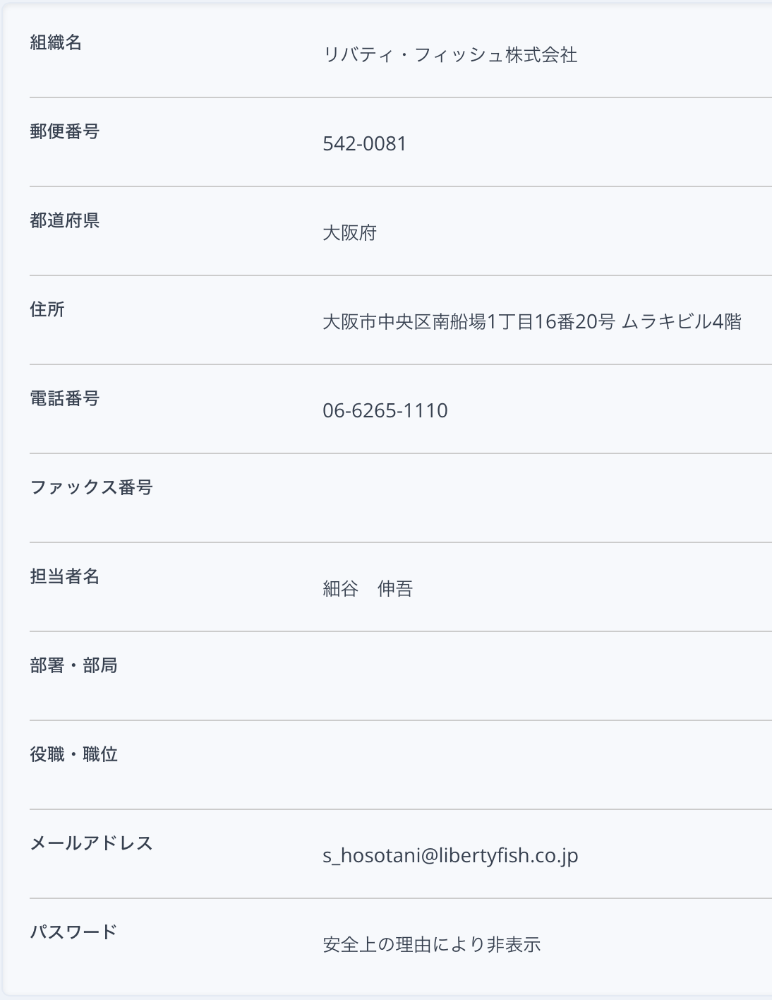
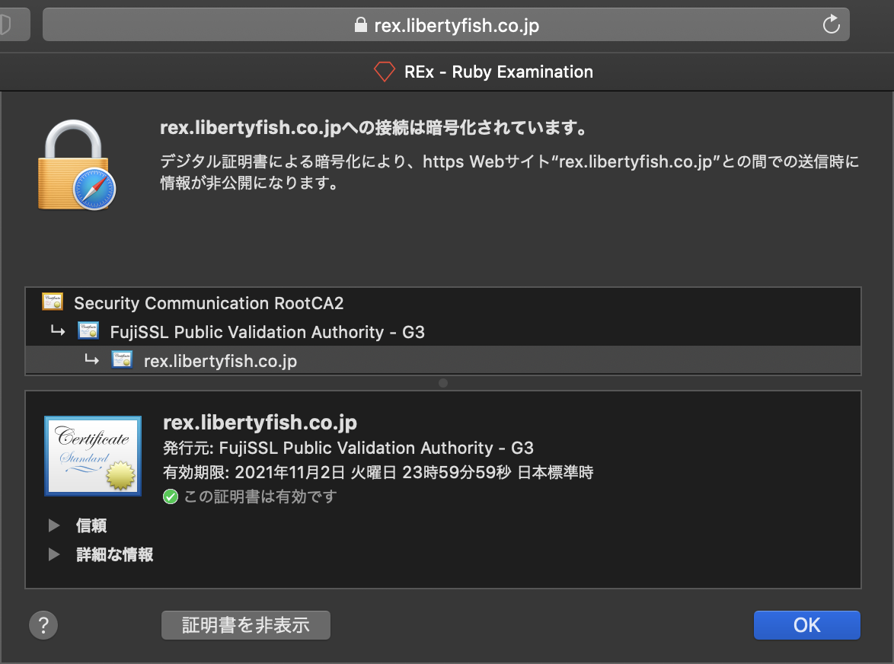

# Update of SSL certificate

RExのSSL証明書は1年毎に更新しています。大体10月下旬に更新手続きが必要です。

サーバー上のSSL証明書が配置された場所
* ssl_certificate: /etc/pki/tls/certs/
* ssl_certificate_key: /etc/pki/tls/private

自分のクレジットカードを利用して決済する。理想は、会社のクレジットカードを切ってもらうこと。その際は、余裕を持って手続きする。
自分のクレジットカードを切った場合は、請求書をPDFで取得して、経費申請する。

## SSL 証明書の購入

1. https://www.ssl-store.jp/system/ にアクセス する。
1. ログインする。会員登録していないのであれば、登録する。
    1. 会員登録するときは「ご登録種別」は法人にして、ちゃんと会社情報を入力すること -> メールアドレス認証するときに社長のメールアドレスが表示される。(会社情報詳細は下の画像を参照)
1. FujiSSL の 1年間有効の証明書を購入するのでデポジットする。
    1. 金額は[証明書購入ページ](https://www.ssl-store.jp/system/service.php/showcase/brand/name/fujissl)で確認する。
    1. [代金支払いページ](https://www.ssl-store.jp/system/service.php/charge/stripe)で金額とカード情報を入力して決済する。
1. FujiSSL の 「更新」リンクをクリックする。
1. 内容を確認して、証明書をカートに入れる。
1. カートを表示して、購入内容を確認して、証明書を購入する。



## サーバーへ接続

[インフォメーション](infomation.md) をもとに接続する。

## CSR の作成

```shell
sudo su -
openssl req -new -key /etc/pki/tls/private/private_key > /etc/pki/tls/certs/rex.2020.csr #<- 出力先ファイルの年は変更すること
```

情報を入力する

```
You are about to be asked to enter information that will be incorporated
into your certificate request.
What you are about to enter is what is called a Distinguished Name or a DN.
There are quite a few fields but you can leave some blank
For some fields there will be a default value,
If you enter '.', the field will be left blank.
-----
Country Name (2 letter code) [AU]:JP
State or Province Name (full name) [Some-State]:Osaka
Locality Name (eg, city) []:Chuo-ku, Osaka-shi
Organization Name (eg, company) [Internet Widgits Pty Ltd]:Liberty Fish co.,LTD
Organizational Unit Name (eg, section) []:
Common Name (e.g. server FQDN or YOUR name) []:rex.libertyfish.co.jp
Email Address []:info@libertyfish.co.jp

Please enter the following 'extra' attributes
to be sent with your certificate request
A challenge password []:
An optional company name []:
```

## SSL 証明書のアクティベート1

1. 証明書 -> 証明書管理 へ遷移
1. 購入した証明書の 「  申請手続(アクティベート)はこちら」を押下
1. 情報をざっと読んで、下部の「次へ進む」を押下
1. 次の情報を入力して、下部の「次へ進む」を押下
    1. コモンネーム: rex.libertyfish.co.jp
    1. ファイル認証
1. 次の情報を入力して、下部の「確認画面へ」を押下
    1. CSR: 上で作成したものをペースト
    1. 組織・団体名: Liberty Fish co.,LTD
    1. 担当者: **自分の名前(ローマ字)**
    1. 国コード: JP
    1. 郵便番号: 542-0081
    1. 所在地: 
        ```
        大阪府
        Chuo-ku, Osaka-shi
        1-16-20, Minamisenba
        MURAKI-BIRU 4F
        06-6265-1110
        info@libertyfish.co.jp
        ```
     1. 担当者情報は「ドメイン管理者情報より反映」を押下
     1. **メールアドレスのみ自身のものに変更すること**
1. 確認画面の内容を確認し、「上記内容で申請を確定する」を押下

## SSL 証明書のアクティベート2

メールアドレス宛にメールが届くので、そのファイルをサーバーにアップロードする

```
scp -P 2021 fileauth.txt deploy@rex.libertyfish.co.jp:/var/www/rails/rex/current/public/.well-known/pki-validation
```

別コンソールで `/var/www/rails/rex/current/public/.well-known/pki-validation` に `fileauth.txt` が存在することを確認する。
10分間隔でクローラー が確認しているので、待機する。

## 証明書の登録

1. [ユーザーポータル](https://product.fujissl.jp) にアクセスして、注文番号と自身のメールアドレスでログインする
1. アクセス要求ボタンが表示されるので、押下すると、自身のメールにURLが送信される
1. メールのURLにアクセスする
1. 「証明書ダウンロード」(rex.libertyfish.co.jp.crt)と中間証明書(ca-bundle.crt)をダウンロードする。
1. `sudo vi /etc/pki/tls/certs/rex.2020.crt` を実行し、`rex.libertyfish.co.jp.crt` と `ca-bundle.crt` の内容を貼り付ける(Nginx は証明書と中間証明書を1つのファイルにしなければならない)。
1. Nginx の設定ファイル(`/etc/nginx/sites-enabled/rex`) の証明書の記述を変更する
    1. 今回は `ssl_certificate /etc/pki/tls/certs/rex.2019.crt` を `ssl_certificate /etc/pki/tls/certs/rex.2020.crt` に変更
1. 設定を反映する(`sudo systemctl restart nginx`)

## 証明書が正しく更新されているか確認

https://www.digicert.com/help/ にアクセスして、 `rex.libertyfish.co.jp` を入力し、次の項目がグリーンであれば問題ない。

* DNS resolves rex.libertyfish.co.jp to (IP Address)
* TLS Certificate expiration
* Certificate Name matches rex.libertyfish.co.jp
* TLS Certificate is correctly installed

https://rex.libertyfish.co.jp にアクセスして、証明書を確認し、有効期限が更新されていればOK


